# [多摩クマ Emoji.01 / TAMA-KUMA Emoji.01]

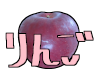

## 説明

|No|word|image|
|-:|-|-|
|1|リンゴありがとう|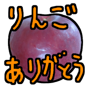|
|2|おめでタイ|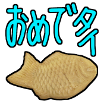|
|3|あっソーダ|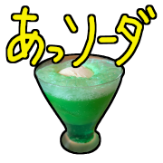|
|4|Yeah!|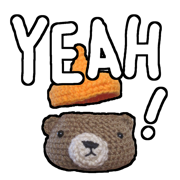|
|5|NICE||
|6|GOOD||
|7|CAD|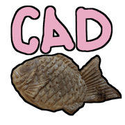|
|8|トホホ||
|9|ハッスル|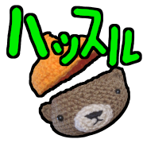|
|10|Love|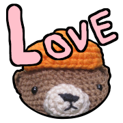|
|11|PEACE||
|12|ひげ|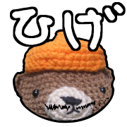|
|13|VIVA|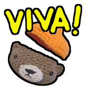|
|14|うまーい|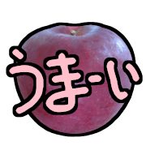|
|15|ふわり|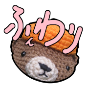|
|16|はて？|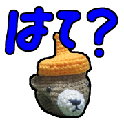|
|17|ありがとー|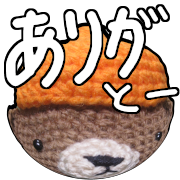|
|18|たすかる|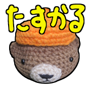|
|19|なるほど|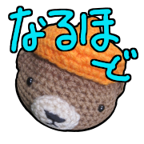|
|20|fine|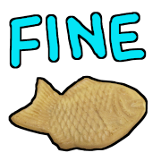|
|21|OK|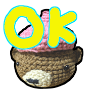|
|22|NG|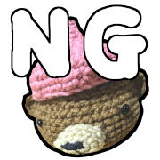|
|23|ナイス|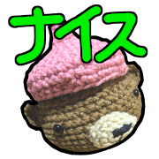|
|24|そっれー|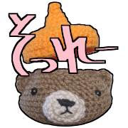|
